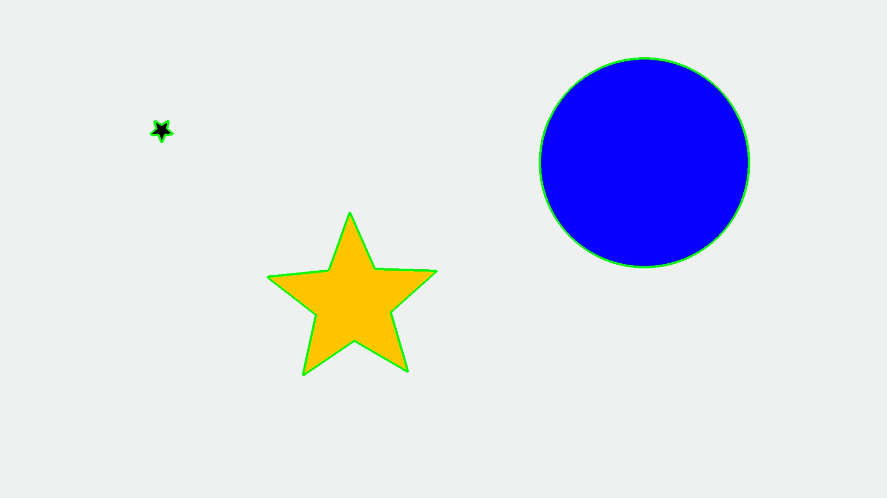

# opencv-edgeDetection
Take image and extract all detected shapes out of it.

### Requirements
+ Python
+ numpy, cv2

### How to use
+ Install requirements
+ Place image in ```/import```
+ Run ```/src/opencv-edgeDetection.py```
+ Output will be located in ```/export/imagename```

### Example
#### Input

#### Output



The black star is too small and thus not extracted.        

 
